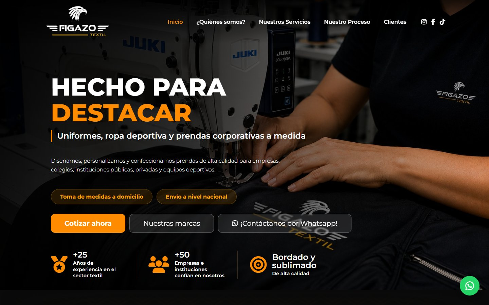

# Figazo Textil

Sitio web que desarrollé como freelance para Figazo Textil, una empresa de confección de uniformes y ropa deportiva en Urubamba, Cusco. Está en producción.

**Web:** https://figazo-texil.netlify.app

Publicada temporalmente en Netlify mientras el cliente obtiene los accesos de su dominio.



## Qué incluye

- Página principal: servicios, proceso de pedido, galería, testimonios, clientes y contacto
- Quiénes somos: misión, visión y líneas de especialización
- Galería con filtros por categoría y visor de imágenes
- Formulario de contacto (Web3Forms), botón de WhatsApp y mapa
- Diseño adaptado a móvil

## Tecnologías

HTML, CSS y JavaScript, sin frameworks ni proceso de build. Despliegue continuo en Netlify desde la rama `main`.

## Detalles técnicos

- El proceso de pedido se dibuja como un arco con Canvas y se vuelve a calcular cuando cambia el tamaño de la ventana. En móvil se muestra como una lista vertical.
- El menú cambia de color según la sección que se está viendo, clara u oscura. Lo detecto con IntersectionObserver.
- El carrusel de testimonios da la vuelta de forma infinita: al pasar la última tarjeta vuelve a la primera sin que se note. Se mueve con flechas, arrastrando o deslizando en el celular.
- El visor de imágenes está en un solo archivo (`js/lightbox.js`) que usan la página principal y la galería. En la galería solo recorre las fotos del filtro elegido.

## Optimización

Las imágenes originales pesaban 46 MB: eran fotos en PNG de hasta 2048 px, algunas mostradas a 48 px. Las convertí a WebP y las redimensioné según su tamaño en pantalla. El sitio completo pasó a 2.7 MB, y las imágenes fuera de pantalla se cargan de forma diferida.

## Estructura

```
index.html            Página principal
Quienessomos.html     Quiénes somos
Galería.html          Galería
css/                  global.css + un archivo por sección
js/menu.js            Interacciones de la página principal
js/lightbox.js        Visor de imágenes compartido
js/galeria.js         Filtros de la galería
imagenes/ galeria/ empresas/
```

## Ejecutar en local

```bash
python -m http.server 8000
```

Y abrir http://localhost:8000.

---

Desarrollado por [Marco](https://github.com/MarcoJosue25). El contenido, los logotipos y las imágenes pertenecen a Figazo Textil.
